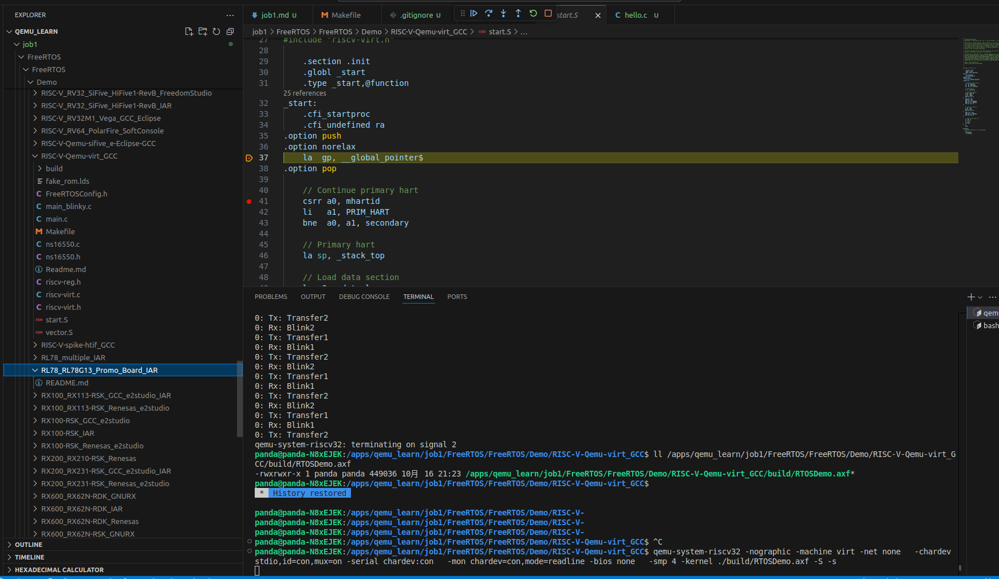

# job1

## 编译安装qemu
由于我本地之前已经编译安装过qemu，这里不再赘述，按照网上的教程进行操作即可。

- 编译过程

https://43db26b9948da27a.81dlg.com/dy/ss?token=13dfa00362f25894b67c8877d061001c


- 最终结果

```bash
panda@panda-N8xEJEK:~$ which qemu-system-
qemu-system-aarch64       qemu-system-mips          qemu-system-s390x
qemu-system-alpha         qemu-system-mips64        qemu-system-sh4
qemu-system-arm           qemu-system-mips64el      qemu-system-sh4eb
qemu-system-avr           qemu-system-mipsel        qemu-system-sparc
qemu-system-hppa          qemu-system-or1k          qemu-system-sparc64
qemu-system-i386          qemu-system-ppc           qemu-system-tricore
qemu-system-loongarch64   qemu-system-ppc64         qemu-system-x86_64
qemu-system-m68k          qemu-system-riscv32       qemu-system-xtensa
qemu-system-microblaze    qemu-system-riscv64       qemu-system-xtensaeb
qemu-system-microblazeel  qemu-system-rx            
panda@panda-N8xEJEK:~$ which qemu-system-aarch64 
/apps/qemu-9.2.2/build/qemu-system-aarch64
```

## qemu user 模式运行不同架构的code
- 本地环境

`uname -a` shows we are running on an x86_64 platform
```bash
panda@panda-N8xEJEK:~$ uname -a
Linux panda-N8xEJEK 6.8.0-57-generic #59~22.04.1-Ubuntu SMP PREEMPT_DYNAMIC Wed Mar 19 17:07:41 UTC 2 x86_64 x86_64 x86_64 GNU/Linux
```

- install cross-compiler for arm platfrom

run `sudo apt install gcc-arm-linux-gnueabi`

- type hello.c

```c
#include <stdio.h>

int main(void) 
{
    printf("hello world from arm");
    return 0;
}
```

- use arm-linux-gnueabi-gcc to compile hello.c

```bash
panda@panda-N8xEJEK:/apps/qemu_learn$ arm-linux-gnueabi-gcc ./hello.c -static
# static build to avoid libc for arm
panda@panda-N8xEJEK:/apps/qemu_learn$ file a.out 
a.out: ELF 32-bit LSB executable, ARM, EABI5 version 1 (SYSV), statically linked, BuildID[sha1]=e36d4b85ef01eba96d9b989d88ff9b5f461fe6ca, for GNU/Linux 3.2.0, not stripped
```

- direct run and use qemu user mode to run
```bash
panda@panda-N8xEJEK:/apps/qemu_learn$ qemu-arm ./a.out 
hello world from arm
```

- what does qemu user mode do?

@todo

## run risc-v free-rtos on qemu

- clone free-rtos git first

```bash
# freertos contains many submodules, so  --recurse-submodules is needed
panda@panda-N8xEJEK:/apps/qemu_learn$  git clone https://github.com/FreeRTOS/FreeRTOS.git --recurse-submodules
```

- according to `FreeRTOS/FreeRTOS/Demo/RISC-V-Qemu-virt_GCC/Readme.md`, we need to install riscv toolchain first

url: https://github.com/sifive/freedom-tools/releases/tag/v2020.12.0

chose the version that matches to you system

- add toolchain path to PATH env (read Readme.md in FreeRtos)

- then run make to make this demo

- run on qemu
```bash
panda@panda-N8xEJEK:/apps/qemu_learn/job1/FreeRTOS/FreeRTOS/Demo/RISC-V-Qemu-virt_GCC$ qemu-system-riscv32 -nographic -machine virt -net none \
  -chardev stdio,id=con,mux=on -serial chardev:con \
  -mon chardev=con,mode=readline -bios none \
  -smp 4 -kernel ./build/RTOSDemo.axf
Hello FreeRTOS!
0: Tx: Transfer1
0: Rx: Blink1
0: Tx: Transfer2
0: Rx: Blink2
0: Tx: Transfer1
0: Rx: Blink1
0: Tx: Transfer2
0: Rx: Blink2
0: Tx: Transfer1
0: Rx: Blink1
0: Tx: Transfer2
qemu-system-riscv32: terminating on signal 2
```

- gdb freertos
```bash
make clean
make DEBUG=1
qemu-system-riscv32 -nographic -machine virt -net none   -chardev stdio,id=con,mux=on -serial chardev:con   -mon chardev=con,mode=readline -bios none   -smp 4 -kernel ./build/RTOSDemo.axf -S -s
```

- config vscode (if you use)

you can use config in `.vscode/setting.json` , do remember to change riscv toolchain dir

- qemu will stop until gdb attached, and can debug now!

